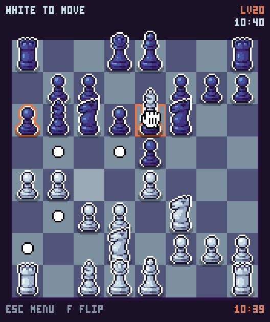

# ♚ Gaia Chess Engine

A free and strong chess engine written in Rust, with a board to play on in the same
executable — and twenty levels of play, from a child's first game to a grandmaster.



**Gaia 4** is a complete rewrite from C to Rust — not a single line of the original code survived. Back after 20 years.

## Play in your browser

**[Play it now on itch.io](https://jromang.itch.io/gaiachess)** — the whole game as a
web page, with nothing to install. The first load fetches the neural network, about
22 MB, cached by the browser afterwards, and the menu is usable while it arrives.

Levels 1 to 19 are bounded by search depth and never by a clock, so they play exactly
the same in a tab as on a desktop, however slow the machine. Level 20 is the exception:
in a browser it is boxed in by what WebAssembly and a single worker allow, and it is
worth meeting on a downloaded build instead.

## Play against it

A pixel-art interface ships in the same binary, built in by default: run `gaiachess`
with nothing after it and the board opens.

**One binary, two ways to run it.** Started on its own, `gaiachess` listens for two
seconds; if nothing speaks UCI in that time it opens the board. A chess interface that
launches it says `uci` straight away and gets the engine, with no delay and no window.
`gaiachess --no-gui` skips the wait and speaks UCI at once, and `gaiachess gui` opens the
board without listening at all. The board is never opened when there is no display to
open it on, so an engine running under a match manager over SSH is unaffected.

Play with the mouse — the hand becomes the cursor, and pieces are dragged and dropped
— or with the arrow keys and `X`. Whichever you touch last is the one in charge, so
the keyboard is never taken away from you by a mouse you did not move. `Z` opens the
in-game menu, `F` turns the board round, `Tab` changes the colour scheme. The menu
sets who plays each side, the level, the clock and the colours; **about** carries the
credits, the licence and an explanation of what the twenty levels do.

## Twenty opponents, not one engine turned down

Levels 1 to 19 run from someone's first game of chess to grandmaster strength, roughly
a hundred and twenty rating points a rung; level 20 is the engine at full strength. The
board's menu shows each level's rating and who it plays like as you pick it, and any UCI
interface can set the same thing with the `Skill Level` option.

| Level | Rating | Plays like | | Level | Rating | Plays like |
|---|---|---|---|---|---|---|
| 1 | 580 | just learned the moves | | 11 | 1750 | strong club player |
| 2 | 700 | learning the pieces | | 12 | 1840 | tournament player |
| 3 | 820 | first few games | | 13 | 1970 | tournament regular |
| 4 | 940 | beginner | | 14 | 2090 | candidate master |
| 5 | 1060 | improving beginner | | 15 | 2200 | expert |
| 6 | 1180 | casual player | | 16 | 2310 | national master |
| 7 | 1300 | keen amateur | | 17 | 2420 | strong master |
| 8 | 1420 | club player | | 18 | 2530 | international master |
| 9 | 1540 | solid club player | | 19 | 2640 | grandmaster |
| 10 | 1660 | steady club player | | 20 | — | full strength |

**Searching less far is not enough.** A network judging positions one ply deep already
plays around 1500, so no cut in depth on its own reaches a beginner — and an engine that
plays the best move of a crude evaluation is dull, never careless. Below full strength
five things give at once: the engine looks less far ahead, judges positions more crudely
(material alone at the bottom of the ladder, then piece squares, then the network),
misjudges them on purpose — usually a little, occasionally by a piece — picks among the
root moves worth playing instead of always the same one, and simply fails to notice some
moves at all. That last one, applied in the quiescence as well as in the search, is what
makes the low levels leave a piece hanging; nothing else does.

Treat the ratings as estimates, but they were anchored outside the engine rather than left
to self-play: levels 8 to 14 were played against networks trained to imitate human play,
which run as bots and so carry a rating earned against people over hundreds of thousands
of games. The two independent anchors agreed to within about a hundred points; the two
ends of the ladder are extrapolated from that line.

Nothing depends on the machine: a level is never a time or a node budget, and every choice
is drawn from the position's own hash, so a level misjudges the same position the same way
every time — stable blind spots rather than a tremor. A given level is the same opponent
on a laptop as on a server.

## Features

### Search

- Principal Variation Search (PVS) with aspiration windows
- Null Move Pruning
- Late Move Reductions (LMR) with history, improving, correction history adjustments
- Singular Extensions with multi-cut
- Reverse Futility Pruning, Futility Pruning, Late Move Pruning
- SEE Pruning (main search + quiescence)
- History Pruning, ProbCut
- Internal Iterative Reductions (IIR)
- Killer Moves, Countermove Heuristic, Butterfly/Capture/Continuation/Pawn History
- Lazy SMP (shared TT, per-thread history)

### Endgame tablebases

- **Syzygy** WDL/DTZ probing up to 7 pieces (`SyzygyPath`)
- **Nalimov** DTM probing (`NalimovPath`) — tablebases available on [Hugging Face](https://huggingface.co/datasets/jromanghf/nalimov-tablebases)
- **GaiaTB**: 3–4 piece DTM tablebases in a custom compressed format, **embedded in the binary** — exact mate distances with zero configuration
- Optional **online tablebase probing** at the root (`OnlineTB`, off by default)

### Evaluation

- **NNUE**: GaiaNet threat-feature architecture (12 king buckets × 768 PST + filtered threat features, ~41K inputs → 640 → CReLU+pairwise → 16 → 32 → 1), 8 output buckets, trained with [Bullet](https://github.com/jw1912/bullet) on self-play data
- **SIMD**: runtime dispatch AVX-512+VNNI / AVX-512 / AVX2 / scalar — one binary, resolved from CPUID at startup (NEON on ARM)
- **Movegen**: per-piece PEXT (BMI2) / AVX2 BLSMSK / magic; setwise AVX-512 Kogge-Stone / scalar — runtime-elected too, with PEXT skipped on the AMD generations that microcode it

### UCI

Full UCI protocol support. Compatible with [Arena](https://www.playwitharena.de/), [CuteChess](https://cutechess.com/), [En Croissant](https://encroissant.org/), and all major chess GUIs.

## Which binary should I use?

One binary per platform. **Windows** binaries end in `.exe`, **Linux** and **macOS** have no extension.
On x86-64 the engine selects its SIMD paths at startup from your CPU — AVX2 up to AVX-512+VNNI for the
neural network, PEXT or AVX2 for move generation — so there is nothing to choose.

| Binary | Platform | Runs on |
|--------|----------|---------|
| `universal` | Windows / Linux x86-64 | Any CPU from ~2013 (Intel Haswell+, AMD Zen+) |
| `compat` | Windows / Linux x86-64 | Any x86-64 CPU (2003+) |
| `neon` | Linux ARM64 | RPi 4+, Graviton... |
| `apple-silicon` | macOS | M1 and later |

Take **`universal`**. Take `compat` only if `universal` does not start (a CPU older than ~2013):
same engine, portable code paths — slower search, a scalar network below AVX2 — but the same chess.

`gaiachess info` prints which paths were selected on your machine; `GAIA_SIMD=scalar|avx2|avx512|vnni512`
and `GAIA_PEXT=0|1` cap the selection for benchmarking or troubleshooting.

All x86-64 binaries are built with Profile-Guided Optimization, every selectable SIMD tier profiled.
The neural network and the GaiaTB tablebases are embedded — no external file needed.

## UCI Options

| Option | Type | Default | Description |
|--------|------|---------|-------------|
| Hash | spin | 16 | Transposition table size in MB (1–1048576) |
| Threads | spin | 1 | Number of search threads (1–256) |
| EvalFile | string | \<internal\> | Path to a NNUE network file |
| Ponder | check | true | Enable pondering |
| MultiPV | spin | 1 | Number of principal variations (1–256) |
| Move Overhead | spin | 100 | Time reserved per move for I/O latency, in ms (0–5000) |
| SyzygyPath | string | \<empty\> | Path(s) to Syzygy tablebase files (`:`-separated) |
| NalimovPath | string | \<empty\> | Path to Nalimov tablebase files |
| OnlineTB | check | false | Probe online endgame tablebases at the root |
| OwnBook | check | true | Vary the openings played below full strength |
| Skill Level | spin | 20 | Playing strength, 1 (a beginner's opponent) to 20 (full strength) |
| Skill Seed | spin | 0 | Which weakened opponent a level is; 0 keeps the built-in one |

## The Story

The first version of Gaia was born in June 2003, in a student apartment in Strasbourg. Back then, David Rabel and I were writing C code between classes, debugging with printf, and testing against Crafty on a single-core Pentium. We were young, we were clueless, we were having a blast.

We released six versions in three years, entered a few French computer chess championships, and then... life happened. Studies, jobs, moving, family. Gaia 3.5 came out in June 2006, and then silence. For almost twenty years. I've since lost touch with David.

In the meantime, the chess programming world has changed beyond recognition. Neural networks went from science fiction to standard equipment. NNUE happened. Open-source engines reached superhuman strength and spawned an entire ecosystem. The [Chess Programming Wiki](https://www.chessprogramming.org/) turned into an incredible knowledge base. Rust appeared and made systems programming actually enjoyable. Tools like SPRT testing brought real statistical rigor to engine development. The community grew, shared, documented everything.

Coming back to chess programming after all this time felt like waking up in the future. Everything I struggled with in 2003 now has a name, a wiki page, and a dozen open-source implementations to learn from. It's humbling and exhilarating at the same time.

So I started over. From scratch. Alone, this time, but standing on the shoulders of an incredible community.

## Acknowledgements

Thanks to Patrick Buchmann, Alex Schmidt, Guenther Simon, Claude Dubois, Leo Dijksman, Patrick Beucler, Dann Corbit, Marcus Geelnard, Gabriel Leperlier, and Raphael Grundrich for their help and support on the early versions of Gaia.

Thanks to Werner Schüle for testing Gaia and reporting tablebase-related bugs.

Gaia 4 stands on the shoulders of the chess programming community. Special thanks to:

- [Bullet](https://github.com/jw1912/bullet) — NNUE trainer
- [Chess Programming Wiki](https://www.chessprogramming.org/) — invaluable knowledge base
- [lichess-org/chess-openings](https://github.com/lichess-org/chess-openings) — the ECO
  catalogue the built-in openings are taken from, released into the public domain under
  CC0 1.0

The graphical interface uses chess pieces drawn by **DrSmey**; its sounds are not files
but a few numbers each, synthesised at start-up. What a board should feel like was learnt
from [Pico Checkmate](https://www.lexaloffle.com/bbs/?tid=31213), a PICO-8 cartridge by
**Krystman** (Lazy Devs). See `src/gui/assets/ATTRIBUTION.md` for the full credits and
licence status of each asset.

## Building from source

Requires a Rust toolchain (edition 2024), `clang` (for the Syzygy probing code), `curl`, and a NNUE network file.

**On Linux, the interface's sound links against ALSA**, so building the default feature
set needs `libasound2-dev` (Debian/Ubuntu) or `alsa-lib` (Arch), and running the result
needs `libasound2`. That is the one thing a headless server may be missing; a build with
no interface in it at all (below) has no such dependency and links against nothing but
libc. Windows and macOS need nothing extra.

```bash
# Download the network (see https://huggingface.co/jromanghf/gaiachess-networks)
curl -L -o nets/gaianet.bin \
  "https://huggingface.co/jromanghf/gaiachess-networks/resolve/main/<network-name>.bin"

# Build with the network embedded
MODEL=nets/gaianet.bin RUSTFLAGS="-C target-cpu=native" cargo build --release --features nnue

# Same, without the graphical interface — and without ALSA to link against
MODEL=nets/gaianet.bin RUSTFLAGS="-C target-cpu=native" cargo build --release \
  --no-default-features --features "nnue,syzygy,gaiatb,online-tb,nalimov"

# Fallback build without NNUE (PeSTO evaluation, much weaker)
cargo build --release
```

A `target-cpu=native` build pins every SIMD path at compile time for the machine it was
built on — fastest, and what the command above gives you. The release binaries are built
differently: a portable baseline plus `--cfg gaia_dist`, which turns on the runtime
CPUID dispatch so one binary carries every SIMD tier. To reproduce one:

```bash
# A `universal`-style binary: runs on any x86-64 CPU from ~2013, picks its paths at startup
MODEL=nets/gaianet.bin RUSTFLAGS="-C target-cpu=x86-64-v3 --cfg gaia_dist" \
  cargo build --release --features nnue
```

Run `cargo test` for the test suite and `cargo run --release -- bench` for the search benchmark.

The NNUE trainer lives in `trainer/` (see its `--help` for usage).

## License

Gaia is free software, distributed under the [GNU General Public License version 3](LICENSE) (or any later version at your option).

© 2003–2026 Jean-François Romang
